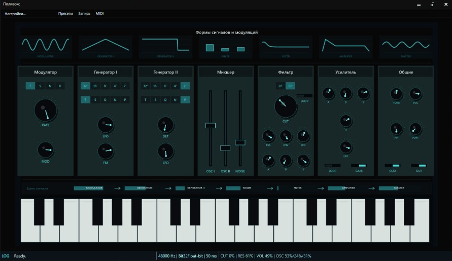

# Polivoks

**Polivoks** — настольный советский синтезатор для Windows, [Formanta Поливокс](https://ru.wikipedia.org/wiki/%D0%9F%D0%BE%D0%BB%D0%B8%D0%B2%D0%BE%D0%BA%D1%81).

Это не копия оригинального инструмента и не попытка выдать программную версию за официальный продукт. Проект берёт у Поливокса настроение, характерный грубый синтезаторный образ, но остаётся самостоятельной современной интерпретацией.

Внутри — кастомно отрисованный тёмный интерфейс, WASAPI-аудио, MIDI-инструменты, пресеты, запись, локализация и контекстные подсказки по саунд-дизайну.



## Об Оригинальном Поливоксе

Оригинальный **Formanta Поливокс** — советский аналоговый синтезатор, выпускавшийся заводом «Форманта» в 1980-х годах. Он запомнился грубым, нестабильным, агрессивным характером, особенно своим узнаваемым фильтром и живым, слегка непредсказуемым поведением модуляций.

Черты оригинала, которые легли в основу проекта:

- Дуофоническое поведение: два генераторных голоса могут следовать разным нотам.
- Два генератора с выбором регистров и форм волн.
- Источник шума, смешиваемый с генераторами перед фильтром.
- Характерный low-pass / band-pass фильтр.
- LFO-модуляция высоты, фильтра и громкости.
- Огибающие для фильтра и усилителя.
- Утилитарная панель с сильной визуальной идентичностью.

Этот проект не стремится быть идеальной схемотехнической эмуляцией. Это современная настольная интерпретация с фокусом на играбельность, атмосферу и рабочий процесс в духе Поливокса.

## Архитектура

Решение разделено на несколько проектов:


| Проект               | Ответственность                                                   |
| -------------------- | ----------------------------------------------------------------- |
| `Polivoks.Core`      | Модель patch, synth engine, DSP-блоки, enum-ы, модели persistence |
| `Polivoks.Audio`     | WASAPI output, запись, экспорт, MIDI rendering                    |
| `Polivoks.Resources` | Rendering, кастомные controls, themes, localization, info tips    |
| `Polivoks.Desktop`   | WPF shell приложения, окна, view models, app services             |
| `Polivoks.Tests`     | Unit и regression tests                                           |


## Требования

- Windows 10 или новее
- .NET 10 SDK
- Audio output device с поддержкой WASAPI

## Сборка

```powershell
cd ..\Polivoks
dotnet build src\Polivoks.Desktop\Polivoks.Desktop.csproj
```

## Запуск

```powershell
dotnet run --project src\Polivoks.Desktop\Polivoks.Desktop.csproj
```

Путь к debug-сборке:

```text
src\Polivoks.Desktop\bin\Debug\net10.0-windows\Polivoks.Desktop.exe
```

## Тесты

```powershell
dotnet test tests\Polivoks.Tests\Polivoks.Tests.csproj
```

## Ссылки

- Исторические материалы и схемы Formanta Polivoks.
- Hyperreal Polivoks schematics archive: [http://machines.hyperreal.org/manufacturers/Formanta/Polivoks/schematics/](http://machines.hyperreal.org/manufacturers/Formanta/Polivoks/schematics/)
- Erica Synths DIY/open module references: [https://github.com/erica-synths/diy-eurorack](https://github.com/erica-synths/diy-eurorack)

## Disclaimer

Этот проект — независимый программный синтезатор, вдохновлённый историческим Formanta Поливокс. Это не официальный продукт, не эмуляция оригинального производителя и не проект, связанный с правообладателями.
